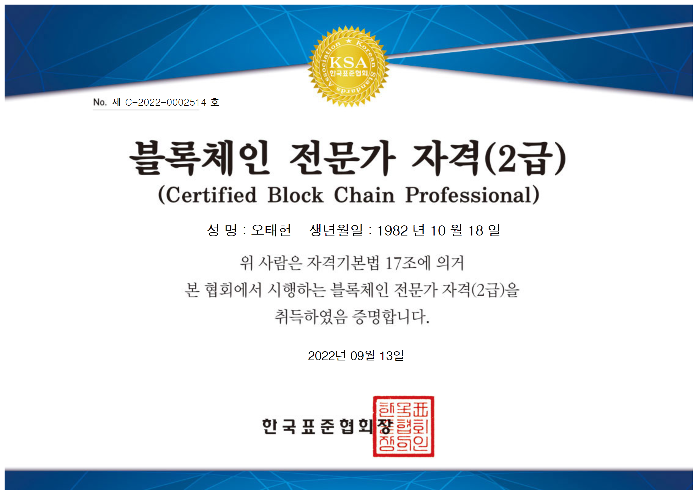

# 하이퍼레저 기반 블록체인 응용서비스 개발과정

# 강의정보
hyperledger 2.2의 permissioned blockchain 교육. 시중에는 아직 하이퍼레저 2.x 버전의 책이나 강의는 없는 상태임. (1.x기반의 교육임).   
3주간 이론 및 실습 교육 을 진행하며 , 1주간의 블록체인 dapp 프로젝트를 진행.   
오프라인 강의장은 충북 청주시 오창군 청주미래누리터 지식산업센터이며, 온라인은 인프런으로 실시간 진행. 온라인 복습은 2일 이후 업로드 되었으며, 수강생들은 여름방학을 이용한 학생이 많았음   
오랜만의 오프라인 강의여서 젊은 열기를 느낄수 있어서 상당히 좋았음. 대학교쩍 느낌도 살짝 났음.   
학생들이라 그런지 리눅스 및 설치 환경구성에 헤딩하는 애들이 많았음 바로 따로오는 애들 반/ 포기하는 분들 반정도됨. 중반정도 지나니 절반정도는 수업에 못따라오는 느낌이랄까 ... 최종적으로 4팀이 개인 프로젝트 진행(나 포함)

# 강사정보
##  황동엽 강사님
 아주 대학원 공학 박사. 블록체인 연구소에서 DID 연구하심
## 신운섭 강사님 
 아주 대학원 공학 박사. 블록체인 연구소에서 DID 연구하심. 국방과학연구원 프로젝트에 참여하신 이력 있음

# 수료증
[수료증.pdf](./수료증.pdf)
# 자격증

# 진행한 프로젝트는 
https://github.com/gymnopedy01/epeople
