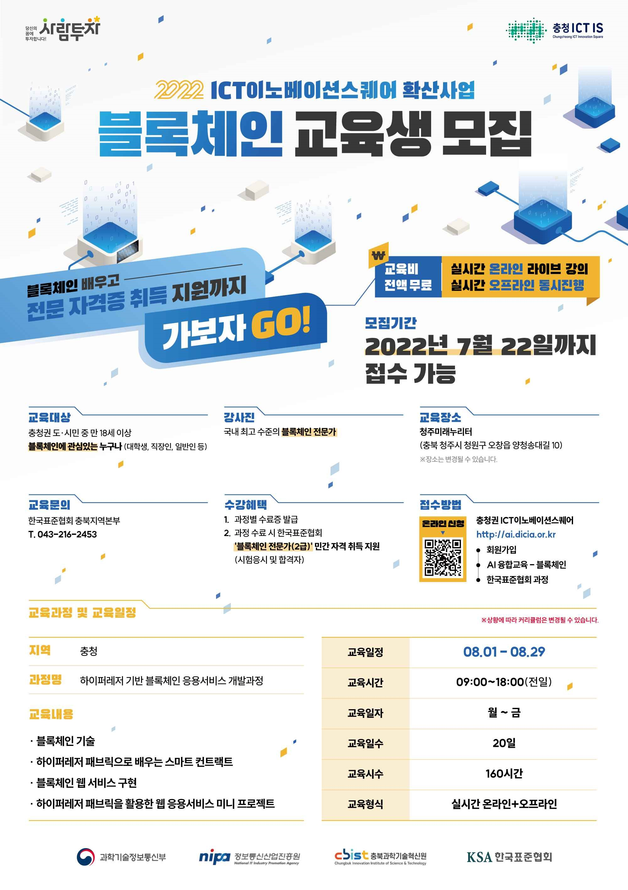

# 하이퍼레저 기반 블록체인 응용서비스 개발과정

# 강의정보
 hyperledger 2.2의 permissioned blockchain 교육. 시중에는 아직 하이퍼레저 2.x 버전의 책이나 강의는 없는 상태임. (1.x기반의 교육임)
 3주간 교육 이후, 1주간의 블록체인 dapp 프로젝트를 진행

# 강사정보
## 아주 대학원 황동엽 박사님 
 블록체인 연구소에서 DID 연구하심
## 아주 대학원 신운섭 박사님 
 블록체인 연구소에서 DID 연구하심

# 수료증
[수료증.pdf](./수료증.pdf)
# 자격증

# 진행한 프로젝트는 
https://github.com/gymnopedy01/epeople
